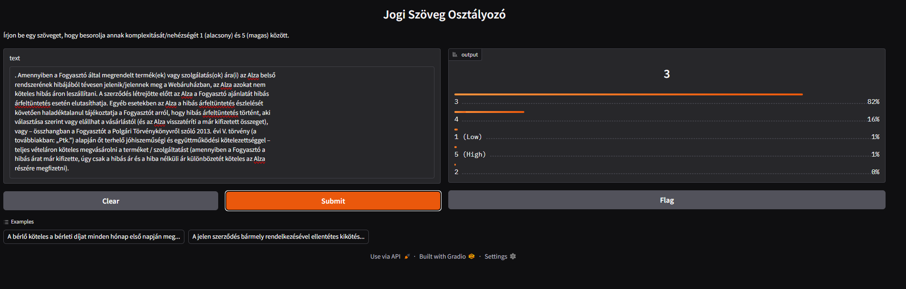
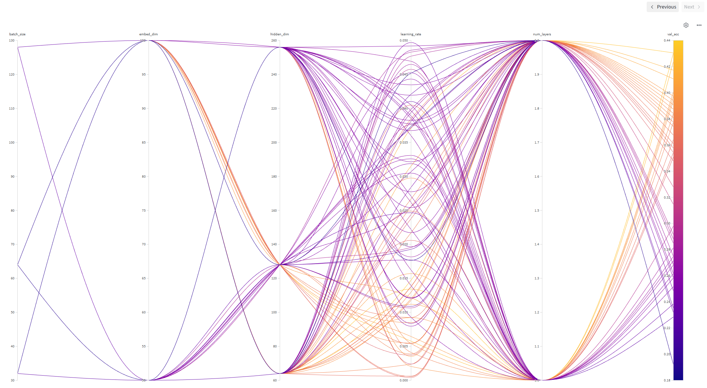
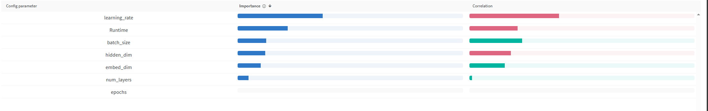
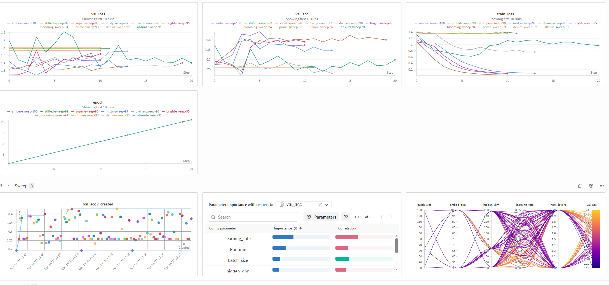

# Legal Text Decoder (VITMMA19 Deep Learning Project)

---

## Project Information

- **Selected Topic:** Legal Text Decoder
- **Student Name:** Benedek Ágota, WFXBHI
- **Aiming for +1 Mark:** Yes

---

## Solution Description


This project addresses the problem of classifying the complexity/difficulty of Hungarian legal texts on a 1–5 ordinal scale. The solution is built as a full machine learning pipeline, including advanced data preparation, baseline and incremental model development, hyperparameter sweep, and a Gradio-based GUI for model serving.



*Figure: The Gradio-based web interface for interactive legal text classification.*

### Key Features

- **Containerized Pipeline:** All steps (data prep, training, evaluation, inference) run in a Docker container.
- **Data Preparation:** Automated download and extraction of the raw dataset, consensus-based test set creation, and advanced preprocessing using NLTK for Hungarian stopword removal.
- **Baseline Model:** Logistic Regression on engineered features for reference.
- **Incremental Model Development:** LSTM-based classifier with hyperparameter sweep (using W&B) for optimal configuration.
- **Advanced Evaluation:** Includes confusion matrices, F1/accuracy/precision/recall, and consensus quality analysis.
- **ML as a Service:** After training, the final model is served via a Gradio web GUI for interactive predictions.
- **Comprehensive Logging:** All steps log to `log/run.log` with configuration, data stats, model details, training/validation metrics, and final evaluation.

---

## Extra Credit Justification

- **Incremental Model Development:** Extensive sweep-based hyperparameter optimization (see attached sweep log and image). For transparency and reproducibility, the original sweep-based training script (`src/02_train_with_sweep.py`) and the sweep run logs are included as evidence of incremental model development and hyperparameter optimization.
- **Advanced Data Preparation:** NLTK-based Hungarian stopword removal and overlap removal between splits. See the file or logs for evidence.
- **ML as a Service:** Gradio GUI for the final model (see attached screenshot).

---

# Hyperparameter Sweep

The hyperparameter sweep was performed using W&B and the script `src/02_train_with_sweep.py`. The sweep explored a range of model parameters and training settings, and the best configuration was automatically selected for the final training run.


*Figure: Example sweep results from W&B showing the optimization process.*


*Figure: The best hyperparameters found during the sweep.*


*Figure: Visualization of the full sweep run and parameter search space.*

- The best model and config are saved in `models/`.
- The pipeline runs the final training automatically with these best parameters.
- The original sweep script and sweep logs are provided as evidence of the incremental development process and parameter search.

---

# Gradio GUI

After training and evaluation, the container launches a Gradio web interface for interactive legal text classification. The interface allows users to input Hungarian legal text and receive a predicted complexity/difficulty score (1–5) with class probabilities.

- **Script:** `src/04_inference.py`
- **Interface:** Textbox input, top-5 class probabilities, example texts (see screenshot above).

---

## Data Preparation

The data preparation script (`src/01_data_processing.py`) performs the following:

1. **Download & Extraction:** Downloads the raw dataset from a provided SharePoint link and extracts it.
2. **Consensus Test Set:** Builds a consensus-based test set from annotation files, ensuring no overlap with training data.
3. **Preprocessing:** Applies NLTK-based Hungarian stopword removal to all texts.
4. **Splitting:** Splits the data into train/validation/test, removing any overlaps between splits.
5. **Saving:** Saves the processed HuggingFace `DatasetDict` to `data/final_split_dataset/`.
---

## Logging

All scripts use a unified logger (`src/utils.py`) that outputs to both stdout and `log/run.log`. The log includes:

- Hyperparameters and configuration
- Data loading and preprocessing confirmation
- Model architecture and parameter counts
- Training and validation metrics per epoch
- Final evaluation results (accuracy, F1, confusion matrix, etc.)
- Inference results

---

## Model Architecture

- **Baseline:** Multinomial Logistic Regression on engineered features (text length, avg. sentence and word length).
- **Main Model:** Bidirectional LSTM with embedding, sweep-optimized hyperparameters (see `models/best_sweep_model_config.json` for final values).

---

## Hyperparameter Sweep

- Sweep configuration and results are managed via W&B (`src/02_train_with_sweep.py`).
- The best model and config are saved in `models/`.
- The pipeline runs the final training automatically with these best parameters.
- The original sweep script and sweep logs are provided as evidence of the incremental development process and parameter search.
- Evidence: [Attach sweep log and image here]

---

## Gradio GUI

After training and evaluation, the container launches a Gradio web interface for interactive legal text classification.

- **Script:** `src/04_inference.py`
- **Interface:** Textbox input, top-5 class probabilities, example texts.
- **Evidence:** [Attach GUI screenshot here]

---


## Docker Instructions (Linux/macOS & Windows)

This project is designed to run efficiently on systems with NVIDIA GPUs using CUDA. The Docker image is based on a CUDA-enabled base image and will automatically use GPU acceleration if available.

### Recommended: Run with Docker Compose

#### Linux/macOS/Windows PowerShell:
```sh
docker compose up
```

#### Windows CMD:
```cmd
docker-compose up
```

This command will build and launch the full pipeline (data preparation, training, evaluation, and Gradio GUI) in a single step. All necessary volumes and runtime options are handled by the included `docker-compose.yml` file.

---

### Alternatively: Run as a standalone container with CUDA

First, build the image:

```sh
docker build -t legal-text-app .
```

Then run the container (choose the command for your OS/shell):

#### Linux/macOS:
```sh
docker run --gpus all \
	-v "$(pwd):/work" \
	-p 7860:7860 \
	--env-file .env \
	-e NVIDIA_VISIBLE_DEVICES=all \
	-e PYTHONPATH=/work \
	-e WANDB_API_KEY=your_wandb_key \
	--name LegalText \
	legal-text-app
```

#### Windows PowerShell:
```powershell
docker run --gpus all `
	-v "${PWD}:/work" `
	-p 7860:7860 `
	--env-file .env `
	-e NVIDIA_VISIBLE_DEVICES=all `
	-e PYTHONPATH=/work `
	-e WANDB_API_KEY=your_wandb_key `
	--name LegalText `
	legal-text-app
```

#### Windows CMD:
```cmd
docker run --gpus all ^
	-v "%cd%:/work" ^
	-p 7860:7860 ^
	--env-file .env ^
	-e NVIDIA_VISIBLE_DEVICES=all ^
	-e PYTHONPATH=/work ^
	-e WANDB_API_KEY=your_wandb_key ^
	--name LegalText ^
	legal-text-app
```

- `--gpus all` enables GPU acceleration (omit for CPU-only).
- `-v ...:/work` mounts your project directory (see above for correct syntax per OS/shell).
- `-p 7860:7860` exposes the Gradio GUI port.
- `--env-file .env` and `-e` flags set environment variables as in docker-compose.
- `--name LegalText` names the container for easier management.
- The container will execute the full pipeline and launch the Gradio GUI for inference.
- Access the GUI at [http://localhost:7860](http://localhost:7860) after the pipeline completes.

---

## File Structure

```
src/
	01_data_processing.py   # Data download, cleaning, splitting, NLTK stopword removal
	02_train_with_sweep.py  # Sweep-based model training (W&B)
	02_train.py             # Final model training with best parameters
	03_consensus_eval.py    # Baseline and LSTM evaluation, metrics, confusion matrix
	04_inference.py         # Gradio GUI for model serving
	model.py                # LSTMClassifier, dataset, and loss definitions
	utils.py                # Logger setup
	run.sh                  # Pipeline runner script
models/                   # Saved models, configs, vocabularies
log/
	run.log                 # Full pipeline log
requirements.txt          # All dependencies (including torch, nltk, gradio, wandb, etc.)
Dockerfile                # Container build instructions
```

---

## Dependencies

All dependencies are listed in `requirements.txt`.
